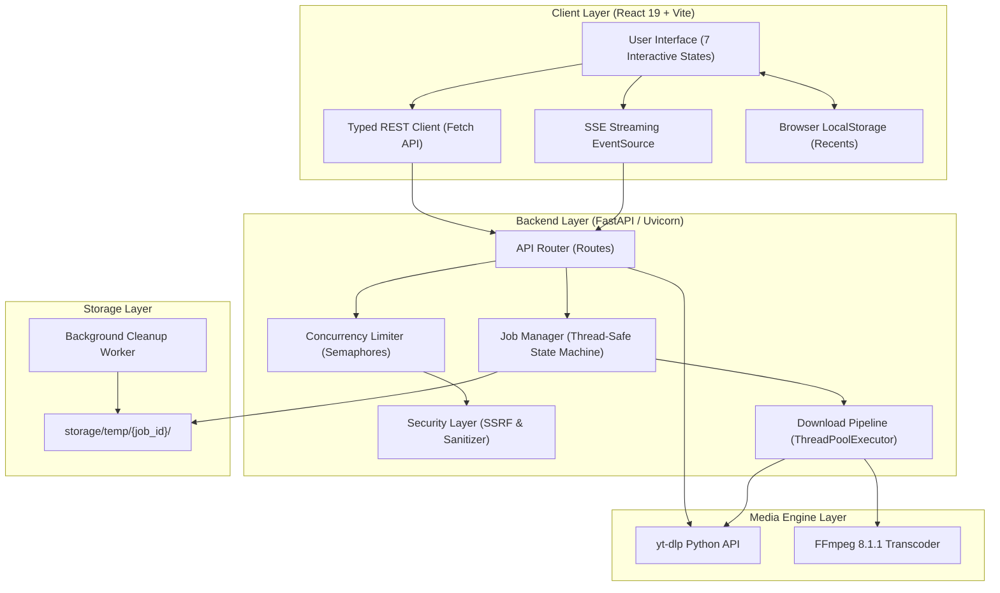
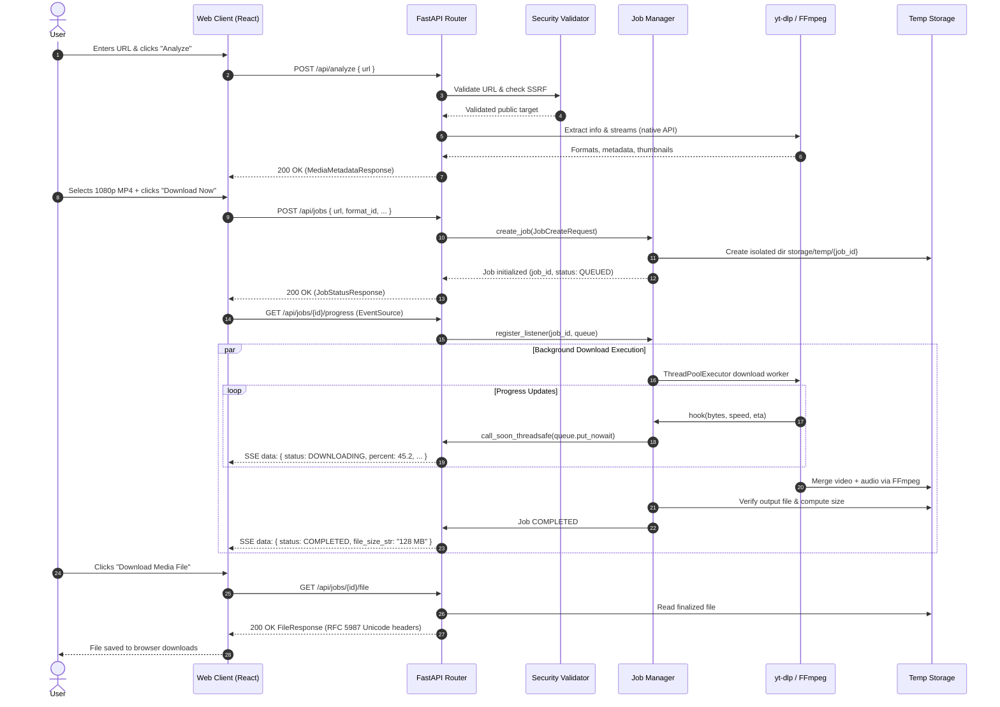

# TrueTube System Architecture

This document describes the design principles, internal components, data flows, and concurrency architecture of **TrueTube**.

---

## 1. High-Level System Architecture

TrueTube is composed of a responsive, modern frontend and an asynchronous Python FastAPI backend. The backend interfaces directly with `yt-dlp` via its in-process Python API and orchestrates media processing pipelines with `FFmpeg`.



---

## 2. Frontend Architecture

### 2.1 State Machine
The client operates on a centralized state machine in [App.tsx](file:///c:/Users/aDmin/Documents/Yt%20Download%20website/client/src/App.tsx):

- `IDLE`: Initial landing state presenting the hero URL input bar, platform chips, and educational feature sections.
- `ANALYZING`: Triggered on URL submission. Displays an animated radar pulse spinner and a 3-step verification checklist while `POST /api/analyze` processes.
- `FORMAT_SELECTION`: Displays the parsed media preview (thumbnail, title, duration, author) alongside format options (Video vs. Audio tabs), resolution radio cards, and the audio stream selector.
- `DOWNLOADING`: Displays real-time progress for active download jobs: percentage gauge, speed telemetry, estimated time remaining, a 5-step breadcrumb timeline, and a cancellation button.
- `COMPLETED`: Displays the emerald success badge, finalized file metadata, direct download action, and a "Download Another" restart trigger.
- `RECENT_DOWNLOADS`: Full-page view displaying the user's historical downloads stored in `localStorage`.

### 2.2 Component Hierarchy

```
App.tsx
├── Navbar.tsx / Header.tsx (Branding, Navigation, Social Links)
├── Toast.tsx (Floating Status Alerts)
├── HeroInput.tsx (URL input, clipboard paste, platform pills)
├── AnalyzingState.tsx (Radar animation, progress checklist)
├── FormatSelector.tsx (Video/Audio tabs, format cards, audio streams)
│   └── AdvancedOptionsDrawer.tsx (Slide-over drawer for audio-only, subs, tags)
├── MediaPreview.tsx (Video specs card, duration, author)
├── DownloadProgress.tsx (Live speed, ETA, 5-stage timeline)
├── CompletedState.tsx (Emerald checkmark, file metadata, download CTA)
├── RecentDownloads.tsx (History cards, re-download anchors, clear action)
├── ErrorCard.tsx (Error classification, contextual troubleshooting)
├── FeatureSections.tsx (4 feature cards, format chips, how-it-works, FAQ, CTA)
└── Footer.tsx (Platform links, legal disclaimers, status indicator)
```

---

## 3. Backend Architecture

### 3.1 Security Layer (`security.py`)
All user-provided URLs undergo strict SSRF validation before network dispatch:
1. **Scheme Validation**: Only `http` and `https` protocols are permitted.
2. **Embedded Credential Stripping**: URLs containing `user:pass@host` syntax are rejected.
3. **DNS & IP Resolution**: Hostnames are resolved via `socket.getaddrinfo`. If a host maps to any private, loopback, link-local, multicast, or reserved CIDR block, it is blocked.
   - `10.0.0.0/8`, `172.16.0.0/12`, `192.168.0.0/16`, `127.0.0.0/8`, `169.254.0.0/16`, `::1/128`, `fc00::/7`, `fe80::/10`.
4. **Obfuscation Detection**: Rejects integer (`http://2130706433/`), hex (`http://0x7f000001/`), and octal encoded IPv4 notations.
5. **Port Filtering**: Non-standard management ports (SSH 22, Telnet 23, SMTP 25, DNS 53, Redis 6379, Memcached 11211, etc.) are blocked.
6. **Path Traversal & Device Name Sanitization**: Filenames are scrubbed of path characters (`/`, `\`, `..`), control characters, and reserved Windows device names (`CON`, `PRN`, `AUX`, `NUL`, `COM1-9`, `LPT1-9`).

### 3.2 Metadata Extraction Engine (`ytdlp_service.py`)
Metadata extraction executes within a threadpool worker with a strict 30-second socket timeout:
- **Vertical Video Handling**: Video height and width are normalized using `min(height, width)` to correctly tier YouTube Shorts, TikToks, and Instagram Reels into standard resolutions (1080p, 720p).
- **Single Recommended Format**: A deterministic algorithm scores formats based on resolution (preferring 1080p Full HD) and bitrate, guaranteeing exactly one format receives the `is_recommended: true` flag.

### 3.3 State Machine & Concurrency (`job_manager.py`)
Each download request is assigned a unique UUID `job_id` and tracked in memory:
- **Thread Safety**: All mutations to the `_jobs` registry are guarded by a reentrant `threading.Lock`.
- **States**: `QUEUED` → `ANALYZING` → `DOWNLOADING` → `PROCESSING` → `FINALIZING` → `COMPLETED` (or `CANCELLED` / `FAILED`).
- **SSE Event Queues**: Each connected client registers an `asyncio.Queue`. When worker threads update progress, updates are dispatched to the event loop using `loop.call_soon_threadsafe(queue.put_nowait, payload)` to ensure zero race conditions on Windows Proactor loops.
- **Cancellation**: Each job contains a `threading.Event()` cancellation token. If the user cancels the job, the token is flagged, `yt-dlp`'s progress hook raises an abort exception, intermediate files are deleted, and the job transitions cleanly to `CANCELLED`.

### 3.4 Pipeline Worker (`download_pipeline.py`)
Downloads are executed by a bounded `ThreadPoolExecutor`:
- **Format Resolution**: Translates user selections (`1080p`, `best`, `audio_only`) into yt-dlp format expressions: `bestvideo[height<=H]+bestaudio/best[height<=H]/best`.
- **Audio Extraction**: In audio-only mode, extracts the highest quality audio stream and invokes `FFmpegExtractAudio` with the target codec (`mp3`, `m4a`, `wav`, `opus`).
- **Transcoder Integration**: Merges separate video and audio streams using FFmpeg into an MP4/WebM container, embeds subtitles (if selected), writes ID3/MP4 metadata tags, and embeds thumbnails.

---

## 4. End-to-End Sequence Diagram



---

## 5. Storage Lifecycle & Garbage Collection

1. **Isolation**: Every job creates an isolated directory `storage/temp/{job_id}/`. All partial chunks, audio tracks, and output containers are contained in this folder.
2. **Automated Expiration (TTL)**: A background daemon thread (`JobCleanupWorker`) awakens every 5 minutes and runs `clean_expired_jobs()`. Any job whose last activity exceeds `FILE_EXPIRATION_SECONDS` (default: 3600 seconds) is evicted from memory and its disk directory is purged.
3. **Orphan Cleanup**: On server startup and shutdown, `JobManager.clean_expired_jobs(ttl=0)` purges any orphaned directories remaining from unexpected terminations.
4. **Windows Lock Resilience**: File deletion uses `safe_rmtree` with multiple backoff retries and readonly flag clearance (`stat.S_IWRITE`) to prevent Windows OS `PermissionError` file-locking failures.
