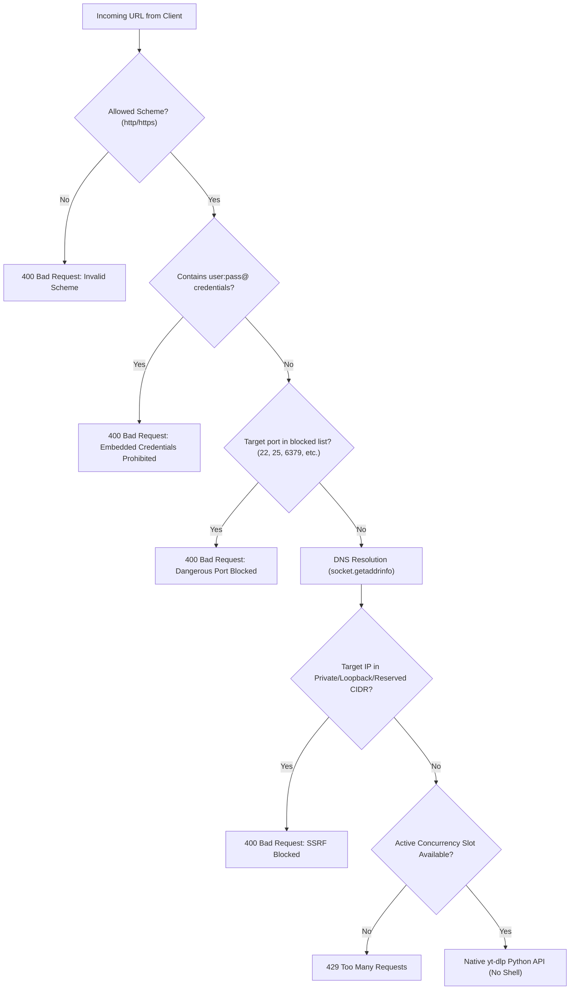

# TrueTube Security Policy & Model

This document outlines the security architecture, threat model, and defensive controls implemented across TrueTube.

---

## 1. Threat Model

TrueTube is a web-facing service that accepts media URLs from untrusted clients, extracts remote media streams, and converts media on local hardware. As a result, the primary attack surfaces are:

1. **Server-Side Request Forgery (SSRF)**: Attempting to abuse the backend to probe internal subnets, access cloud metadata services (e.g., AWS/GCP `169.254.169.254`), or interact with local daemon ports (Redis, Docker, MySQL).
2. **Subprocess & Command Injection**: Attempting to supply malicious shell metacharacters or flags to underlying media tools.
3. **Path Traversal & Filesystem Manipulation**: Attempting to write or read arbitrary files outside the designated temporary storage directory.
4. **Denial of Service (DoS)**: Exhausting server CPU, memory, network, or disk capacity via concurrent heavy video downloads.

---

## 2. Defensive Controls & Architecture

### 2.1 SSRF Defense-in-Depth

TrueTube's security filter in [server/app/core/security.py](file:///c:/Users/aDmin/Documents/Yt%20Download%20website/server/app/core/security.py) implements multi-tier validation:

- **Strict Protocol Whitelist**: Only `http://` and `https://` are permitted. Schemes such as `file://`, `gopher://`, `ftp://`, `ssh://`, or `data://` are immediately rejected.
- **Credential Stripping**: Any URL containing embedded authentication (`user:pass@host`) is rejected to prevent credential masking or parser divergence.
- **Obfuscated IP Address Detection**: Detects and decodes:
  - Decimal representation: `http://2130706433/` (`127.0.0.1`)
  - Hexadecimal representation: `http://0x7f000001/` (`127.0.0.1`)
  - Octal representations.
- **Host & Subnet Validation**: Hostnames are resolved into IPv4/IPv6 IP addresses and compared against known reserved subnets:
  - `10.0.0.0/8` (Private network)
  - `172.16.0.0/12` (Private network)
  - `192.168.0.0/16` (Private network)
  - `127.0.0.0/8` (Loopback)
  - `169.254.0.0/16` (Link-local / Cloud Instance Metadata Services)
  - `::1/128`, `fc00::/7`, `fe80::/10` (IPv6 loopback & private subnets)
- **Dangerous Port Filtering**: Explicitly bans administrative or unencrypted internal services:
  - FTP (`21`), SSH (`22`), Telnet (`23`), SMTP (`25`), DNS (`53`), POP3/IMAP (`110`, `143`), SMB (`445`), Redis (`6379`), Memcached (`11211`), MongoDB (`27017`), Elasticsearch (`9200`), etc.

### 2.2 Shell Injection Elimination
**Zero Shell Invocations**: TrueTube does not invoke yt-dlp through `os.system()` or `subprocess.run(shell=True)`. Instead, it invokes the native Python package `yt_dlp.YoutubeDL()` with strictly typed in-memory option dictionaries. Parameter values cannot break out into arbitrary bash or cmd commands.

### 2.3 Filesystem & Filename Sanitization
To prevent path traversal (`../../etc/passwd`) or Windows device denial-of-service:
- User-controlled titles are sanitized with `sanitize_filename`:
  - Strips path separators (`/`, `\`, `:`).
  - Truncates filenames to a safe 180 characters.
  - Checks for Windows reserved filenames (`CON`, `PRN`, `AUX`, `NUL`, `COM1-9`, `LPT1-9`) and prepends `truetube_` if matched.
- All file generation is confined within `storage/temp/{job_id}/`.
- File serving via `GET /api/jobs/{id}/file` validates that the target file path resides strictly inside the job's assigned temporary directory.

### 2.4 Resource Quotas & Denial of Service Protection
- **Concurrency Limiting**: Uses asynchronous semaphores (`ConcurrencyLimiter`) to cap concurrent metadata analyses and active download jobs. Excess requests receive HTTP 429.
- **Execution Timeouts**: Network sockets time out after 15 seconds; metadata extraction threads time out after 30 seconds.
- **Ephemeral Storage TTL**: Completed and failed files are automatically pruned after 3600 seconds (1 hour).

### 2.5 Unicode & Header Security
File serving endpoints adhere to RFC 5987 / RFC 6266. Manual `Content-Disposition` header concatenation is avoided in favor of Starlette's native encoding, preventing header injection and Latin-1 decoding errors with international titles.

---

## 3. Reporting Security Issues

If you discover a security vulnerability in TrueTube, please do not file a public GitHub issue. Instead, report findings to:

- **Security Contact**: `security@truetube.local`
- **Response SLA**: Vulnerability reports are acknowledged within 24 hours with an initial assessment and mitigation plan within 48 hours.
